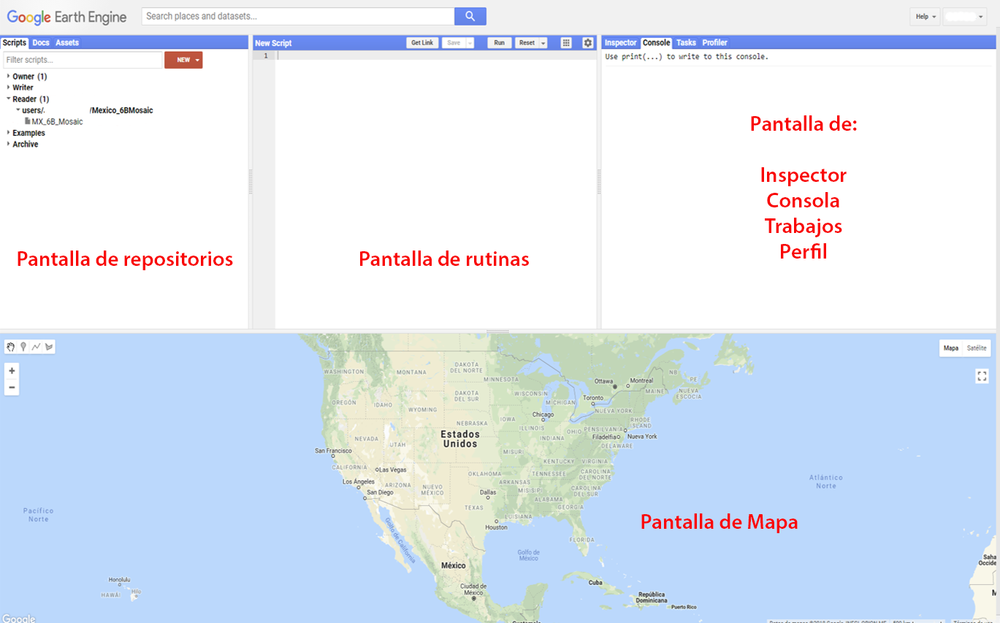
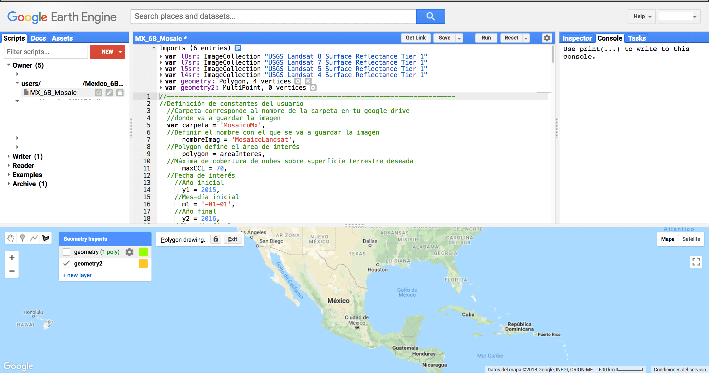
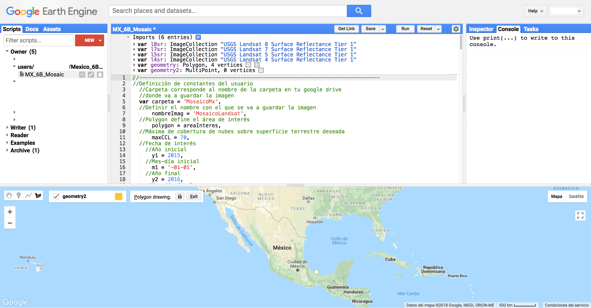
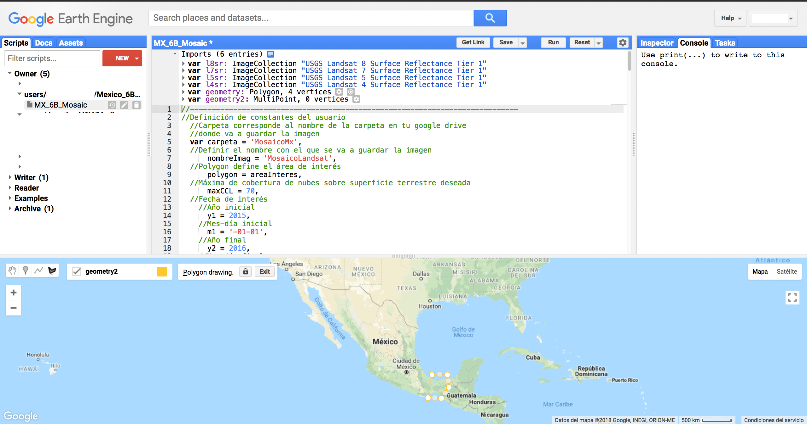
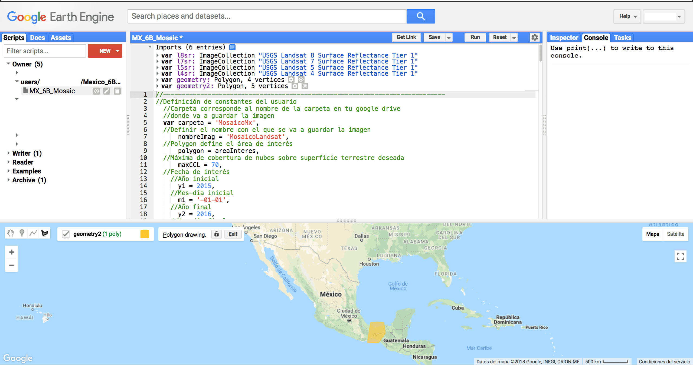
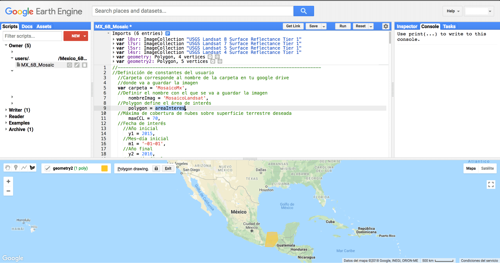
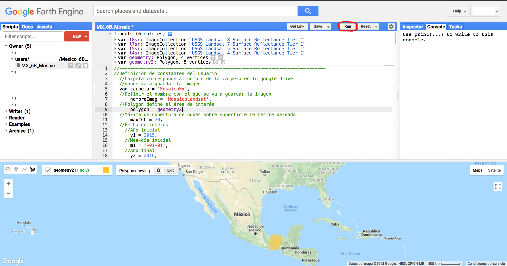

Tutorial uso rutina GEE para hacer mosaicos
===========================================

Pantalla de inicio
------------------

Elementos básicos son: - Pantalla de rutinas - Pantalla de repositorios
- Inspector, Consola, Trabajos - Mapa

Correr la rutina
----------------

Irse al ícono de polígono.

Aparece el siguiente menú.

Dar click en "new layer"
 y aparece geometría nueva (p.ej. 2).

Apagar la capa de arriba (flechita de la izquierda).

Ir a la pantalla del mapa. 

Dar click sobre el área de interés. Aparece un punto blanco.

Mover el cursor para delimitar el área de interés.

Dar click en otro vértice. 

Continuar con el mismo procedimiento colocando vértices.

Continuar colocando vertices. 

Hasta cerrar la figura y que aparezca el relleno con color.

Notar que en la parte superior de la pantalla de rutinas, aparece la
variable geometry2. Está localizada en la parte inferior de la pantalla
de definición de variables. 

Dar click en el nombre (en morado) y da la opción de renombrar la
variable a como uno quiera. En este caso dejaré el nombre igual, como
geometry2.

A continuación, en la parte de la rutina se busca la variable polygon =
areaInteres.

Se cambia areaInteres por el nombre del polígono que dibujó el usuario,
es decir, geometry 2.

De esta manera queda así. A continuación le damos click en Run.

Durante el proceso en la pantalla del mapa en la esquina superior
derecha se verán barritas cargando.

Una vez cargadas las barras grises aparece la imagen dentro del área de
interés.

Se hace zoom al área de interés con el scroll del mouse o utilizando los
botones de + y - de la pantalla del mapa en la esquina superior izquierda.

Le damos click en donde dice geometry imports.

Apagamos las capas que tengamos activadas (dar click en la felchita del
lado izquierdo).

Podemos ver el mosaico.

Inspeccionar valores de pixeles
-------------------------------

En la pantalla superior derecha podemos inspeccionar el valor de los
pixeles en el mapa. Dar click en la pestaña Inspector.

Se debería ver así.

Ir al mapa.

Dar clck en alguna región donde haya información de algún pixel.

Aparece el valor del pixel en las bandas.

Si se da click en otra área se actualizan los valores.

Exportar resultados
-------------------

Ir a la pestaña de Tasks (marcada en naranja) y darle click.

Aparece esta pantalla, dar click en Run.

Aparece la siguiente pantalla con la información del archivo a guardar
en tu Google Drive, nombre del trabajo, tamaño de pixel, folder donde lo
va a guardar y nombre del archivo.

Dar click en Run. 

Aparece un engranito al lado del trabajo que se corrió. Dar click en Run.

Esperar hasta que aparezca una palominta en donde se ve el engrane y
aparecerá en tu drive la imagen descargada.

Parámetros del código
-------------------

carpeta: Corresponde al nombre de la carpeta en donde deseas guardar la imagen creada en tu google drive.

nombreImag: Nombre del archivo de la imagen que se va a guardar

polygon: Corresponde al polígono del área de interés

maxCCL: Corresponde al porcentaje máximo de nubosidad deseado en una imagen para incluirla en la creación del mosaico anual.

y1: Año inicial del periodo de análisis

m1: Mes y día inicial del periodo de análisis

y2: Año final del periodo de análisis

m2: Mes y día final del periodo de análisis

yTot: Un término calculado automáticamente que contiene el total de años a analizar.

allSensors: Término para elegir si se quieren utilizar todos los sensores Landsat o únicamente alguno de ellos.

funcion: Variable para elegir la función con la cual se va a construir el mosaico. Hay 6 opciones: media, moda, mediana, máximo, mínimo y media por intervalo. En caso de elegir esta última, se pueden indicar los percentiles inferior y superior con lo que se desea calcular la media. 