
Tutorial uso rutina GEE para hacer mosaicos
===========================================

Pantalla de inicio
------------------

Elementos básicos son: - Pantalla de rutinas - Pantalla de repositorios
- Inspector, Consola, Trabajos - Mapa

Abrir el código
---------------

Dentro de la pantalla de repositorios irse a la sección "Reader" y
seleccionar MX\_6B\_Mosaic. Dar click y debería aparecer lo siguiente:

Correr la rutina
----------------

Irse al ícono de polígono

Aparece el siguiente menú 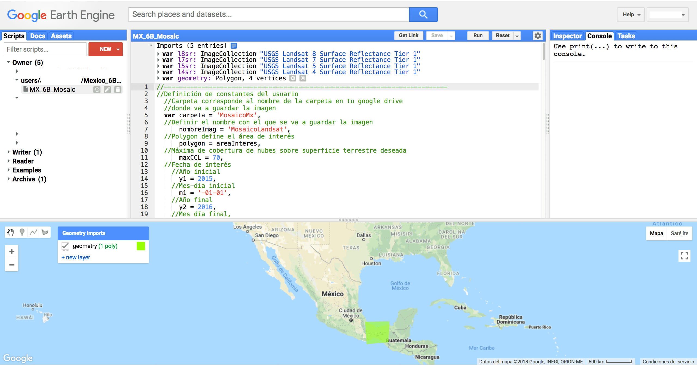

Dar click en new layer  y aparece
geometría nueva (p.ej. 2)

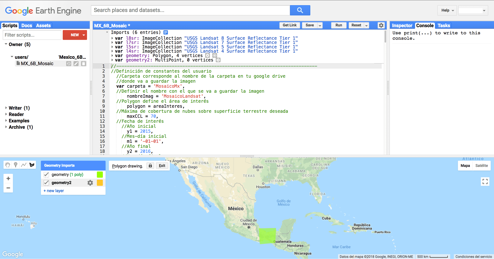

Apagar la capa de arriba (flechita de la izquierda)

Ir a la pantalla del mapa 

Dar click sobre el área de interés, aparece un punto blanco

Mover el cursos para delimitar el área de interés
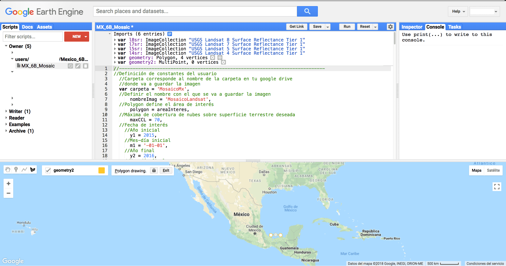

Dar click en otro vértice 

Continuar con el mismo procedimiento colocando vértices

Continuar colocando vértices 

Hasta cerrar la figura y que aparezca el relleno con color

Notar que en la parte superior de la pantalla de rutinas, aparece la
variable geometry2 Está localizada en la parte inferior de la pantalla
de definición de variables 

Dar click en el nombre (en morado) y da la opción de renombrar la
variable a como uno quiera. En este caso dejaré el nombre igual, como
geometry2

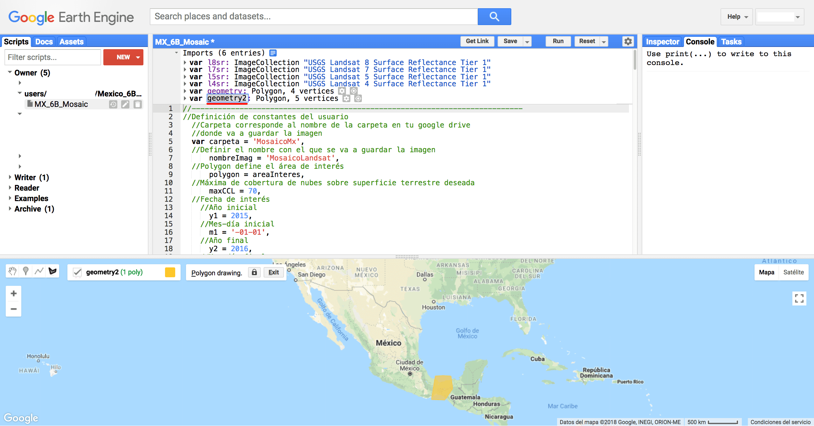

A continuación, en la parte de la rutina se busca la variable polygon =
areaInteres.

Se cambia areaInteres por el nombre del polígono que dibujó el usuario,
es decir, geometry 2.

De esta manera queda así. A continuación le damos click en Run

Durante el proceso en la pantalla del mapa en la esquina superior
derecha se verán barritas cargando.

Una vez cargadas las barras grises aparece la imagen dentro del área de
interés

Se hace zoom al área de interés con el scroll del mouse o utilizando los
botones de + y - de la pantalla del mapa en la esquina superior
izquierda.

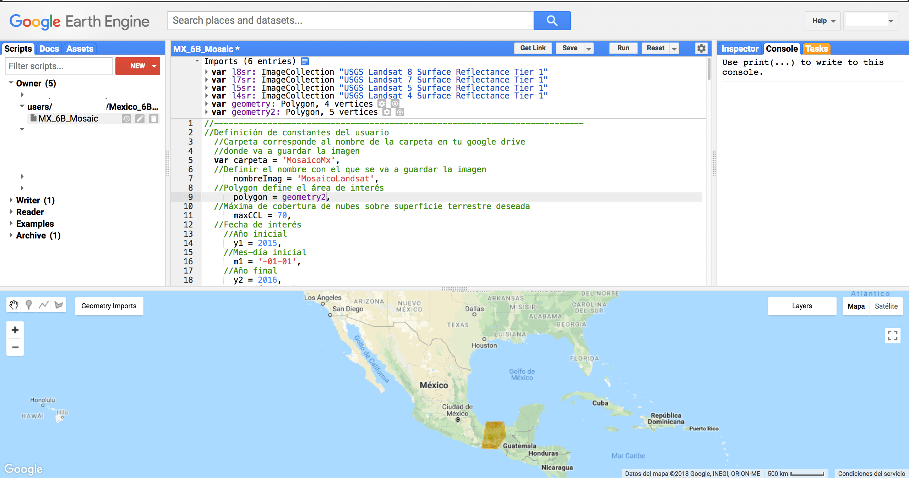

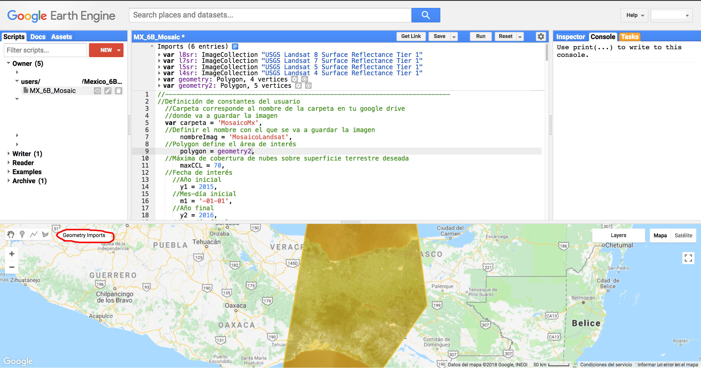

Le damos click en donde dice geometry imports

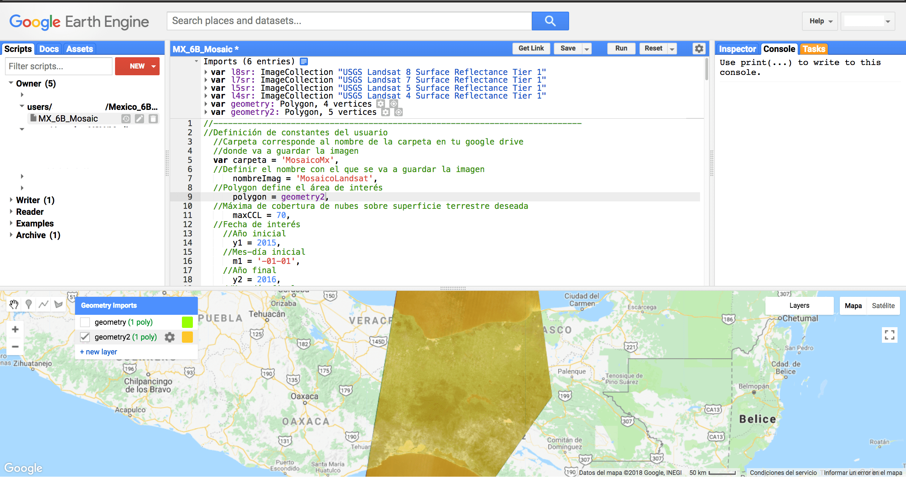

Apagamos las capas que tengamos activadas (dar click en la felchita del
lado izquierdo).

Podemos ver el mosaico

Inspeccionar valores de pixeles
-------------------------------

En la pantalla superior derecha podemos inspeccionar el valor de los
pixeles en el mapa. Dar click en la pestaña Inspector

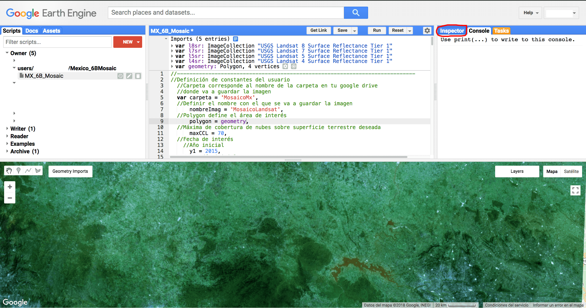

Se debería ver así

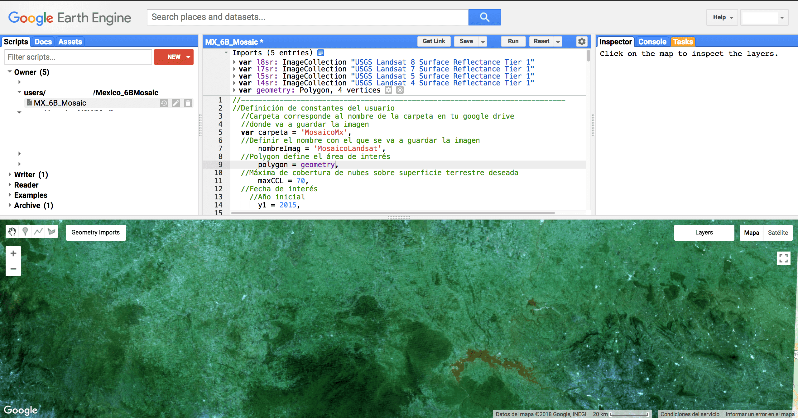

Ir al mapa

Dar clck en alguna región donde haya información de algún pixel

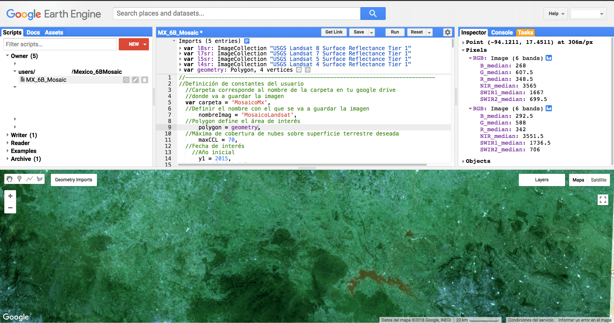

Aparece el valor del pixel en las bandas
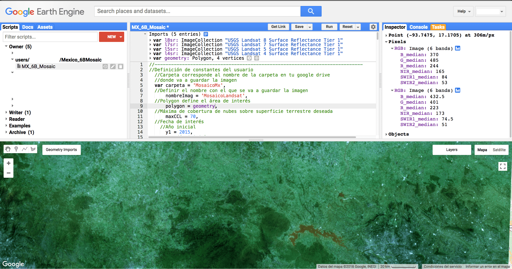

Si se da click en otra área se actualizan los valores

Exportar resultados
-------------------

Ir a la pestaña de Tasks (marcada en naranja) y darle click

Aparece esta pantalla, dar click en Run

Aparece la siguiente pantalla con la información del archivo a guardar
en tu Google Drive, nombre del trabajo, tamaño de pixel, folder donde lo
va a guardar y nombre del archivo
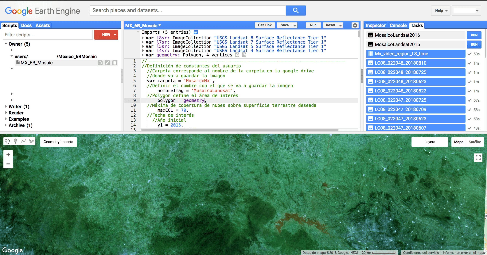

Dar click en Run 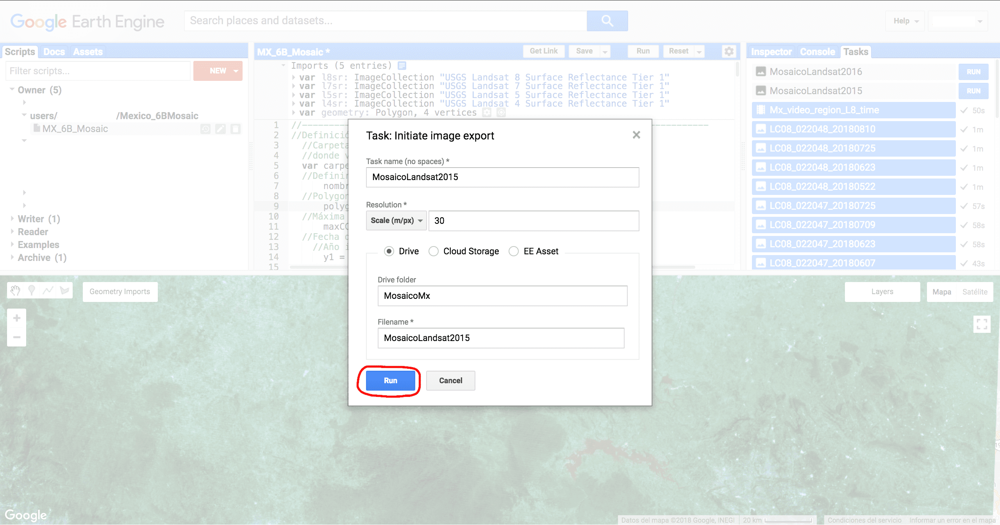

Aparece un engranito al lado del trabajo que se corrió Dar click en Run
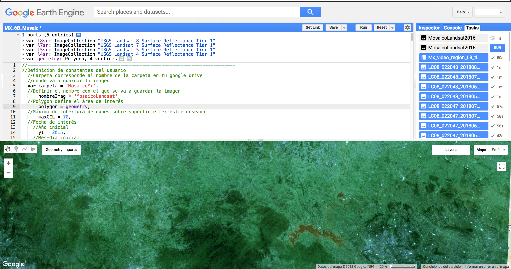

Esperar hasta que aparezca una palominta en donde se ve el engrane y
aparecerá en tu drive la imagen descargada.

En caso de que durante alguno de los procesos ocurra un error, éste será
indicado en la pestaña de la consola. Se recomienda leer la sección de
Debugging de la plataforma, disponible en la siguiente liga:
<https://developers.google.com/earth-engine/debugging>

Algunos de los errores más comunes incluyen: 
1. La falta de definición
de los nombres de todas las variables (var). 
2. Sobrepasar el límite por
default de pixeles a descargar. 
3. No poseer de suficiente espacio en el
Google Drive personal. 
4. La falta de ; al final de cada comando. 
5.
Errores ortográficos. 
6. Sobrepasar el límite de procesamiento.a 
7.
Sobrepasar el límite de procesamiento.b

Las soluciones a cada uno de estos problemas son los siguientes: 
1.
Revisar que todas las variables hayan sido declaradas con la función
var. 
2. En la línea final de exportación de la imagen cambiar el valor
de maxPixels. 
3. Borrar archivos que no se utilicen en el Google Drive.
4. Revisar que todos los comandos finalicen con ;. 
5. Revisar los
nombres de las variables y funciones (cuidando mayúsculas y minúsculas).
6. Cuando ocurre esto normalmente se debe a que se quiere visualizar el
resultado de un procesamiento tardado. La solución sencilla es no
visualizar el resultado en el visualizador de la plataforma, sino sólo
descargarlo. Google Earth Engine permite una mayor capacidad de
procesamiento cuando se exportan los resultados que cuando se quiere
visualizarlos. 
7. A veces se puede sobrepasar el límite de procesamiento
por utilizar códigos redundantes. Este tipo de errores se pueden
solucionar leyendo cuál es el método más apropiado para la función que
el usuario desea realizar.
